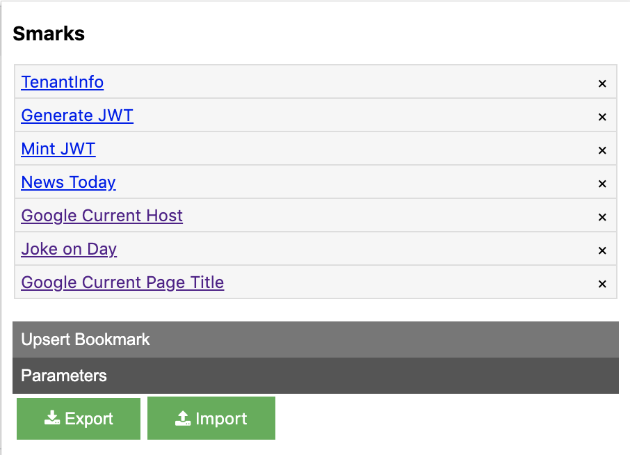

# Chrome Extension For Parameterized Bookmarks => Smarks

Smarks (Smart Bookmarks) is chrome extension built using the TypeScript and Visual Studio Code. The starter code is taken from https://github.com/chibat/chrome-extension-typescript-starter

## Why & How?
Every developer opens a bunch of tabs with slight changes to the URL as part of the development or test processes. In these scenarios the regular bookmark will not work. There are cases where I wanted to
* Open a new tab with the same domain/origin as the current tab with some static URL path
* Open a new tab by taking few values from the current tab as part of the URL.

The above 2 use cases required the bookmarks to support parameters and parameter value to be substituted with context specific runtime values.

### Example 1

#### Url:
 ___{{CurrentTabOrigin}}___/qa/cdp/mintedjwt.jsp?issuerId=___{{OrgId}}___&audienceId=___{{TenantId}}___&type={{TokenType}}

#### Parameter Definitions

| Name |  Value |  Comments |
|---|---|---|
| CurrentTabOrigin  |  $ActiveTab::origin | Takes the domain from the current active tab  |
| OrgId |  $ActiveTab$Js::document.querySelector("body > table > tbody > tr:nth-child(2) > td:nth-child(2)").textContent.trim() | Runs the given java script in the current active tab. |
| TenantId  |  $ActiveTab$Js::document.querySelector("body > table > tbody > tr:nth-child(3) > td:nth-child(2)").textContent.trim() |  Same as above |
| TokenType | JWT | Static value |

### Example 2

#### Url:
 https://www.google.com/search?q=Tell me a joke about {{DayOfWeek}}

#### Parameter Definitions

| Name |  Value |  Comments |
|---|---|---|
| DayOfWeek  |  $Js::new Date().toString().split(' ')[0] + 'day' | Runs the given java script and takes the value.  |

### How to use

- Adding a bookmark
    
    1. Click on the Upsert Bookmark
    1. Enter the name & url, enclose the parameters with {{}}
    1. Click upsert.
- Editing a bookmark
    
    1. Double click on any of bookmark link.
    1. Click on the Upsert Bookmark to show the name and url text boxes.
    1. Make changes as necessary.
    1. Click upsert. 
- Deleting a bookmark
    
    1. Click on the x button next to the link to delete it.
- Adding/Editing/Deleting Parameter
    
    1. Same as Bookmarks.

## Contact Info to report issues
You can reach me smarttoolsprod@gmail.com. Feel free to fork the code and make it better.

## Build and setup

### Prerequisites

* [node + npm](https://nodejs.org/) (Current Version)

### Option

* [Visual Studio Code](https://code.visualstudio.com/)

### Project Structure

* src/model: Model interfaces
* src/utils: Parameter, String, HTML and other utilities
* src/controllers: Chrome store and popup screen controller
* piublic: static files
* dist: Chrome Extension directory
* dist/js: Generated JavaScript files

### Setup

```
npm install
```

### Build

```
npm run build
```

### Build in watch mode

#### terminal

```
npm run watch
```

#### Visual Studio Code

Run watch mode.

type `Ctrl + Shift + B`

### Load extension to chrome

Load `dist` directory

### Test
`npx jest` or `npm run test`
